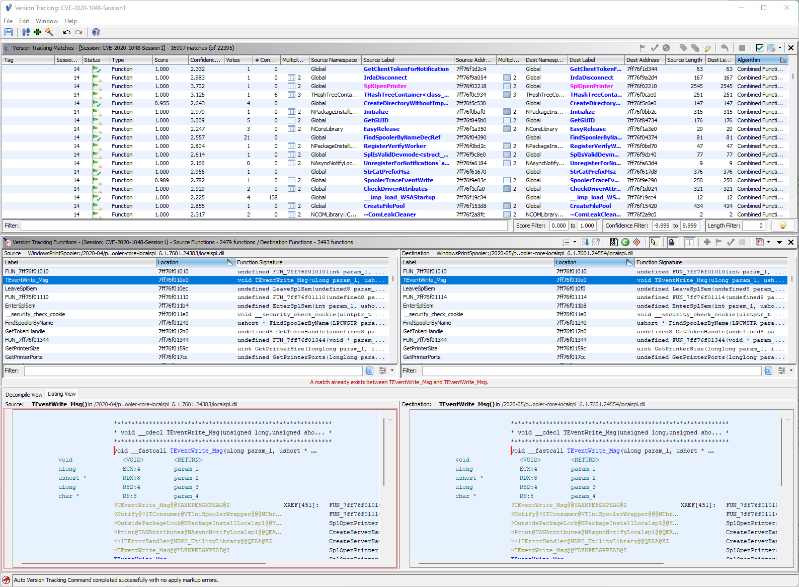
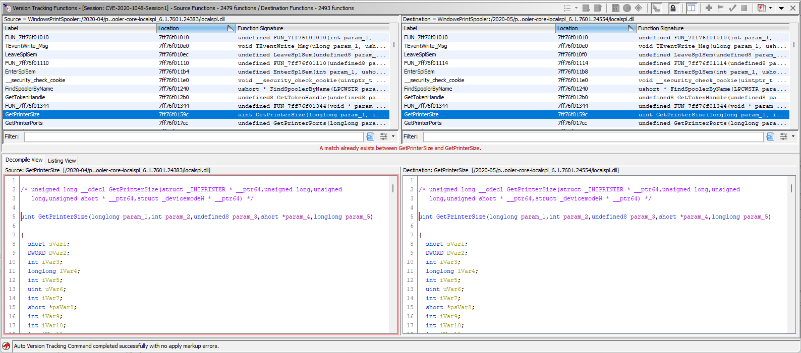
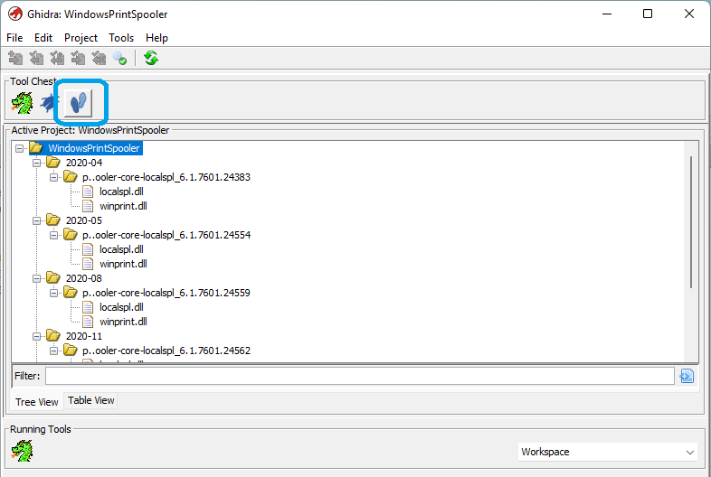
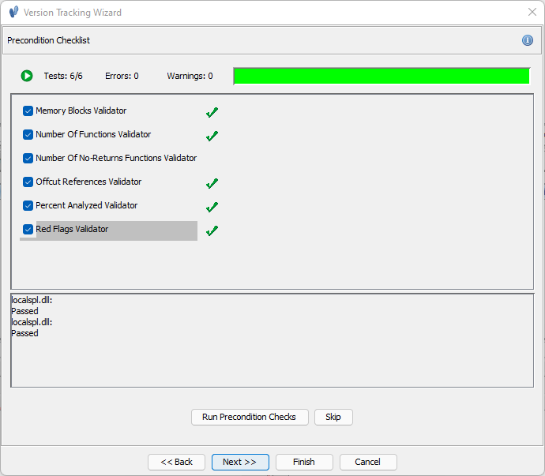
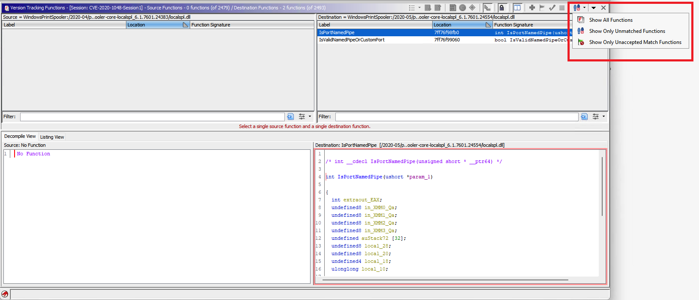

# Ghidra Version Tracking

Patch Diffing with Ghidra can be performed by its **[Version Tracking Tool](https://ghidra.re/courses/GhidraClass/Intermediate/VersionTracking_withNotes.html#VersionTracking.html)**.  Not to be confused with its [Program Difference Tool](https://github.com/NationalSecurityAgency/ghidra/blob/master/Ghidra/Features/ProgramDiff/src/main/help/help/topics/Diff/Diff.htm) (which identifies changes in two applications for *porting changes* (aka binary patching) rather than *identifying* them for comparison.)

> Version Tracking refers to the process used by reverse engineers to identify matching code or data between different software binaries. One common use case is to version track two different versions of the same binary.  [Version Tracking Ghidra - ghidra2018](https://raw.githubusercontent.com/NationalSecurityAgency/ghidra/master/Ghidra/Features/VersionTracking/src/main/help/help/topics/VersionTrackingPlugin/Version_Tracking_Intro.html)

The Version Tracking tool in Ghidra was built with two primary purposes:
- Port previous reverse engineering work to new binary (ie. bring over comments, labels, and other metadata considered *Ghidra Markup*)
- Determine whether or not code in the old binary exists in the new, and vice versa

Of the two purposes, patch diffing is concerned with the latter.  

## The Process

>This is the ultimate purpose of version tracking, to retain any progress that has already been made in understanding the code and be able to proceed despite any changes to the original binary. [Version Tracking Ghidra - ghidra2018](https://raw.githubusercontent.com/NationalSecurityAgency/ghidra/master/Ghidra/Features/VersionTracking/src/main/help/help/topics/VersionTrackingPlugin/Version_Tracking_Intro.html)

For patch diffing, the ultimate purpose is to detect both changes and similarities between two binaries.  This ability will highlight **changes**, **additions**, and **deletions**. 

### High Level 
The version tracker tool provides a workflow to compare the code and data two different binaries by establishing a *session*, loading and auto-analyzing the binaries (after passing *precondition* checks), creating and identifying code and data *associations* using *correlators*, and eventually creating *matches* by assigning a score to the associations. 

Version Tracking Mini-glossary:
- **session** -  records the history and state of the version tracking session.  The order that correlators are run can affect the match results.
- **association** - a pairing of information between the two compared binaries 
	- information being metadata associated with the correlator algorithm, memory address, and type of item being associated (data or function)
- **correlator** - an algorithm used to score specific associations based on code, program flow, or any observable aspect of comparison
- **match** - an association that has been assigned a score
- **preconditions** - list of sanity check items the indicate that a binary has been sufficiently analyzed. This promotes the most accurate operation of the matching algorithms.

Leveraging the matches created by the workflow, trusting that `funcA1234` from Binary Version A is the same as `funcB5678` from Binary Version B, the number of functions to manually analyzes is greatly reduced. As the correlators begin to reduce the number of functions to analyze, the differences begin to emerge and an analyst can quickly begin to discover important changes to the binary.

### Analyst View

The workflow is performed  within the Version Tracker Tool GUI which is modeled as. These Windows will all be opened once initial setup is complete. 

```mermaid

flowchart TD

A[Version Tracker View]<-->B[Source Binary Code Browser]
A<-->C[Destination Binary Code Browser]


```

#### Version Tracker View

This is the main patch diff analysis portal. In the upper pane of this window, is the *Version Tracking Matches Table*. After you have selected some correlations to run, you view the results of all the created matches within this view.  The matches will include important details such as the score (the % of similarity for the match) and the correlator or algorithm used to create the match. 

In the *Version Tracking Functions* lower pane, you can select unmatched functions from the source and destination binary for direct comparison (both assembly and decompilations views are provided).

#### Code Browser (Source and Destination)

Ghidra Code Browsers are opened up for both the source and destination binaries.  The navigation within the Code Browsers are linked to the Version Tracker Tool.  As you select various functions within the Version Tracker view, the functions are auto selected and opened in the corresponding Code Browser tools.

## Version Tracker Workflow 

```mermaid

graph TD;

A[Create Session] --> B[Load Binary Version A];
A --> C[Load Binary Version B];
B --> D[Pass Preconditions];
C --> D; 
D --> E[Auto Analyze A/B];
E --> F[Choose / Run Correlators];
F --> G[Generate Associations];
G --> H[Evaluate Matches];
H --> I[Accept Matching Functions];
I --> J[Discover Enough Differences];
J -- Yes --> K[End];
J -- No --> F;


```

```mermaid

graph TD;

A[Create Session] --> B[Load Binary Version A];
A --> C[Load Binary Version B];
B --> D[Pass Preconditions];
C --> D; 
D --> E[Auto Analyze A/B];
E --> F[Choose / Run Correlators];
F --> G[Generate Associations];
G --> H[Evaluate Matches];
H --> I[Accept Matching Functions];
I --> J[Discover Enough Differences];
J -- Yes --> K[End];
J -- No --> F;


subgraph Setup And Prep - Step 1
A;
B;
C;
D;
end

subgraph Auto Analysis - Step 2
E;
end

subgraph Run Correlators + Evaluate - Step 3 and 4
F;
G;
H;
I;
J;
K;
end

```

### Setup and Prep (Step 1)

Collect the binaries that you want to compare and if possible, grab the [symbols](Environment%20Setup%20and%20Tooling.md#Symbol%20Collection%20mostly%20required).  This can simply be two binaries to compare,  or a collection of binaries across patches. Ideally, put them all in the same place. See [File Collection suggested](Environment%20Setup%20and%20Tooling.md#File%20Collection%20suggested).

Create a New Project in Ghidra.  Batch import them all into the same project: 

Click on the Version Tracker icon:

From there start a new Version Tracking Session ( *File --> New Session*) which will kick off the *Version Tracking Wizard*. Give your session a name. 

Select your binaries. 

#### More Than Two
Each session is currently limited to two binaries. If there is more than one version of the binary to compare, multiple sessions will have to be performed to see differences related to each.

```mermaid

graph LR;

BinaryV1-- Session -->BinaryV2
BinaryV2-- Session2 -->BinaryV3
BinaryV3-- Session3 -->BinaryV4


```

That being said, there is nothing preventing the analyst from comparing the oldest binary to the newest.  In that case, the granularity of the changes in between will be lost, but it depends on the goals and needs of the analysis. 

```mermaid

graph LR;

BinaryV1-- Session -->BinaryV4

```

#### Precondition Checks
Before analysis begins, Ghidra will offer to run through some precondition checks. 

### Auto-analysis (Step 2)

This step in the workflow simply loads both binaries into Ghidra's standard Code Browser and applies the auto-analysis standard procedure to the binaries.  As for any reverse engineering, [symbols](https://docs.microsoft.com/en-us/windows/win32/dxtecharts/debugging-with-symbols) here are helpful, but not entirely necessary.  Only one correlator (*Exact Symbol Name Correlator*) directly relies on the symbol names. 

This pop up will appear if you are loading binaries into the tracking session that have yet to be analyzed within your Ghidra project workspace. Make sure you have [symbols](Environment%20Setup%20and%20Tooling.md#Symbol%20Collection%20mostly%20required) loaded and click *Yes*.

### Run Correlators  (Step 3)

> **correlator** - an algorithm used to score specific associations based on code, program flow, or any observable aspect of comparison

After the binaries have been analyzed, it will be time to select the correlators for the current session.  Correlators can be kicked off manually (*File --> Add to Session*) or automatically (*File --> Automatic Version Tracking*).

 Ghidra's List of Correlators 

As mentioned, correlators are algorithms or methods that take various inputs (basic blocks, data, functions) and create an association between two binaries and score them based on some heuristic. 

Generally, for all binary comparison tools, there are 3 ways ([Source](https://arxiv.org/abs/1909.11424)) to determine whether or a function or data is the same (a match) in each binary : 

- **Syntax** - compare representation of actual bytes or sequence of instructions
    - Pros - Easy to compute, just hash the two binaries
    - Cons - Not generally realistic. Compiling the same source twice with the same compiler will generate a different hash, as this neive approach doesn't consider the time based metadata put into a binary by the compiler. 
- **Semantics** - compare the meaning is equivalent or provide the same functionality, or has similar effects
    - Pros - Less susceptible to metadata or simple compiler changes.
    - Cons - To prove two functions are semantically equivalent basically boils down to the [halting problem](https://en.wikipedia.org/wiki/Halting_problem). 
- **Structure** - a blend of semantic and syntax. Analyzes graph representations of binaries ( control flow, callgraphs, etc. ) and computes similarity on these generated structures
    - Pros - More general. A control flow is a type of semantic, and easier to compute. 

The list of provided correlators within Ghidra seem to primarily be a combination of syntax and structure correlators. 

#### Correlator Application Order
>In general, users should first run correlators that will find obvious matches and allow for automated matching and markup of a good portion of the destination program. [Ghidra Help 2018](https://github.com/NationalSecurityAgency/ghidra/blob/master/Ghidra/Features/VersionTracking/src/main/help/help/topics/VersionTrackingPlugin/VT_Workflow.html#L74)

Ghidra suggests intuitively to start with the obvious correlators to find exact matches (syntax) as exact byte correlators have a high degree of accuracy.  These correlators will run to find functions and data that match exactly, then create matches by scoring the discovered associations. Some of the correlators will **automatically accept the matches**, reducing the workload for the analyst. This intuition has been added with a *Automatic Version Tracking* action. 

>The Automatic Version Tracking action uses various correlators in a predetermined order to automatically create matches, accept the most likely matches, and apply markup all with one button press. The following correlators are run in this order:
> - Exact Symbol Name Correlator
> - Exact Data Correlator
> - Exact Function Bytes Correlator
> - Exact Function Instructions Correlator
> - Exact Function Mnemonics Correlator
> - Duplicate Function Instructions Correlator
> - Combined > - Function and Data Reference Correlator  
> [Ghidra Help 2018](https://github.com/NationalSecurityAgency/ghidra/blob/master/Ghidra/Features/VersionTracking/src/main/help/help/topics/VersionTrackingPlugin/VT_Tool.html#L128)

For patch diffing, this is the preferred method. Again, the idea is to boost the signal (differences,additions,deletions) by getting rid of the noise (functions that haven't changed). 

Further details about correlators can be found with the [Ghidra Correlator Documentation](https://raw.githubusercontent.com/NationalSecurityAgency/ghidra/master/Ghidra/Features/VersionTracking/src/main/help/help/topics/VersionTrackingPlugin/VT_Correlators.html) and there have even been some [custom ones](https://github.com/threatrack/ghidra-patchdiff-correlator) created to overcome some of the pitfalls of the built-in correlators. 

The results of running a correlator will be reflected in the Version Tracker GUI. The top pane will list the matches. 

Each matches table row will provide a *Score* (the similarity of the function), a *Source Label* and *Destination Label* (function name from auto analyiss or provided symbols), and an algorithm (the correlator issuing the result).  

#findaplaceforthisinfo The cost however is *accuracy* in and *time*.  For example a 950KB Windows binary took about 20 mins to run through all the suggested correlators, vs about half the time with symbols loaded. This is because symbols provide Ghidra with some quick matches allowing subsequent runs of the correlators to run on the already matched functions (a 1 to 1 relationship vs a 1 to N). 

#### Boosting The Signal

>This uses Ghidra’s Version Tracking to diff a libpng update in order to extract the patch changes from it. While it works, it only works because the diffed library had symbols. **Ghidra is lacking a correlator to match functions that are only similar but include changes.** Ghidra is only good matching near identical functions, i.e., functions that did not change with the update.  
>[Patch Diffing with Ghidra - mich2019](https://blog.threatrack.de/2019/10/02/ghidra-patch-diff/)

Unfortunately, none of Ghidra's default correlators provide a score other than 100%. You are either a match or you aren't (based on each correlators criteria.)  

> Thus, I currently wouldn’t recommend Ghidra for patch diffing.
> **Update 1:** Now that there is [PatchDiffCorrelator](https://github.com/threatrack/ghidra-patchdiff-correlator) I fully recommend Ghidra for patch diffing! 
> [Patch Diffing with Ghidra - mich2019](https://blog.threatrack.de/2019/10/02/ghidra-patch-diff/)

Luckily, a new plugin was created that helps solve this. Once you find the matches, you can run the PatchDiffCorrelator on the matches (to save you from running it on all functions and never completing that task). The new correlator is able to produce matches with a similarity score below 1.0, which is necessary for identifying functions that have the same symbol name, but are actually different.

The plugin provides three new *Bulk Correlator* options listed in increasing likelihood of generating a match or decreasing level of similarity required for matching:
- **Bulk Instructions Match** - Tokenize all *instuctions* within a function and place them in a unordered list.  (`pop ebp, ret, mov EBP,ESP, etc.`)
- **Bulk Mnemonics Match** - Tokenize all *instuctions mneumonics* (more coarse match) and place them in an unordered list (`pop,ret,mov, etc`)
- **Bulk Basic Block Mnemonics Match** - Tokenize all Mnemonics across basic blocks (a code sequence with no branches and only one entry and exit point) through the function.  These are placed into a list of all basic blocks of the function, sorted, and hashed.  These lists are then compared across the two functions.  This Bulk correlator has the most chance of matching a function with subtle changes. 

### Evaluating Matches (Step 4)

>Ultimately, the analyst has to inspect the actual code to make a determination about which associations represents a valid match.
>[Version Tracking Ghidra - ghidra2018](https://raw.githubusercontent.com/NationalSecurityAgency/ghidra/master/Ghidra/Features/VersionTracking/src/main/help/help/topics/VersionTrackingPlugin/Version_Tracking_Intro.html)

Even though Ghidra automates quite a bit with *Automatic Version Tracking* and provides many built-in correlators, in the end the analyst has to do some work to identify whether or not specific functions match and whether or not the analysis is done. The process of evaluation is best summed up in the latter half of the workflow diagram.

```mermaid

graph TD;

F[Choose / Run Correlators] --> G[Generate Associations];
G --> H[Evaluate Matches];
H --> I[Accept Matching Functions];
I --> J[Discover Enough Differences];
J -- Yes --> K[End];
J -- No --> F;


```

This evaluation of matches step in the workflow is the most difficult part. Making sense of the function matches, and filtering out the functions that didn't change in a meaningful way. The analyst relies heavily on the correlators to make the association, provide a score, and auto accept functions that clearly match.  This reduces the number of functions to review from thousands to hopefully just 10s of functions. It typically involves in some sort of cyclic match generation and potentially running of additional correlators on the remaining matches:

```mermaid

graph TD;

subgraph First Set of Correlations
A[Eval Matches] --> B[Apply Obvious Match Filter];
B --> C[Accept Matches];
end

subgraph Subsequent Correlation Run
C --> D[Eval Match Subset];
D --> E[Apply Another Correlator];
E --> F[Accept Matches];
end

F --> G[Manually inspect results];

```

Subsequent correlators can be run after *Automatic Version Tracking* to provide further clarity. Some correlators will run faster after the obvious matches are made because they no longer have to consider all of the possible functions and just run on the remaining unmatched, or conversely they can run the correlations on already accepted matches. Either way, they are able to optimize as they no longer have to deal with previously accepted matches.  

This process can be more of an art than a science. Running correlators in a different order can produce different results. User experience may vary.  The analyst can experiment by creating several different sessions using the same two binaries for comparison. 

Ideally, the correlators have done their work, and all the analyst has to do is review the results with the changes, additions, and deletions identified. 

#### Identifying  Changed Functions
After correlations have run, the matches appear in the match table of the Version Tracker View as mentioned above. From this window the analyst can identify which functions have changed by looking at the score. Changed function should have a score somewhere between (0.1 and .9999).  

These function can be inspected by selecting them in the upper pane and switching to either the source or destination Code Browser tool or selecting them in the the lower pane (for a quick review). 

#### Identifying New Functions

New functions will not be found in the match table (as there was no match).  Rather to single out new functions found within the destination binary, take a look at the lower pane *Version Tracking Functions*. To see new functions that only exist within the *destination* binary, apply the filter "Only Unmatched Functions" from the drop down in the upper right corner of the lower pane. 

#### Identifying Deleted Functions

Deleted functions will also not be found in the match table. They will in the *Source* column of the *Version Tracking Functions* pane when the same "Only Unmatch Functions" filter is applied. In the case above, no deleted functions were identified. 

#### The Ambiguity of the Leftovers
The above instructions for identifying the new and deleted functions are a bit more complicated.  There the possibility that a function slipped through all of the correlators and is not matched, not a new function, and not a deleted function.  In this case, the analyst might have to determine the match from manual comparison. The lower pane offers the ability to pull up functions one by one to visually inspect them in both assembly (listing) or their decompiled view.   If there are too many unmatched, the analyst will likely need need to run another correlator to reduce the set.  This being the case, when symbols are provided for the binaries, the default correlators have done well to avoid unmatched functions.  

## Getting to work

Now that we have an understanding of the tool and Ghidra is loaded up with all the of files necessary for patch diffing, we will move onto actually [performing the patch diffing](Patch%20Diffing%20Applied.md) across several sessions to see clearly what changes were introduced across the set of Windows Print Spooler CVEs.  

```mermaid
gantt

    title Patch diffing sessions comparing N-1,1048,1337,17001
    dateFormat  YYYY-MM-DD
	axisFormat %Y-%m
	
	section Relevant CVEs
	N-1 :a1, 2020-04-14, 2020-05-11 
    CVE-2020-1048 :a2, 2020-05-12, 2020-06-08
	CVE-2020-1337 :a3, 2020-08-11, 2020-09-07
	CVE-2020-17001 :a4, 2020-11-10, 2020-12-07
	
    section Patch Diffing Sessions
    Session1  :l1, 2020-04-14, 2020-06-08 
    Session2 :l2, 2020-06-08, 2020-09-07
	Session3 :l3, 2020-09-07, 2020-12-07
	
```

