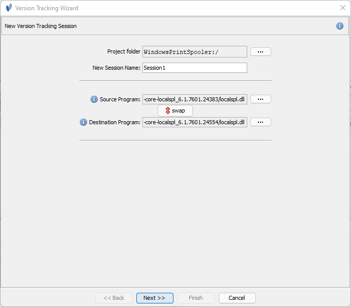
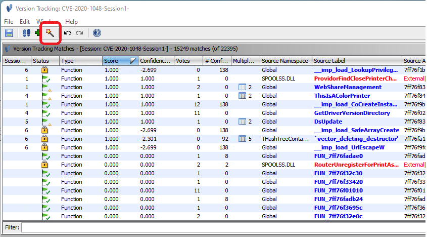
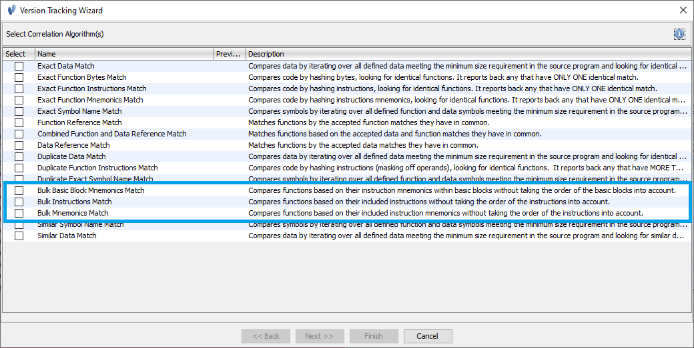
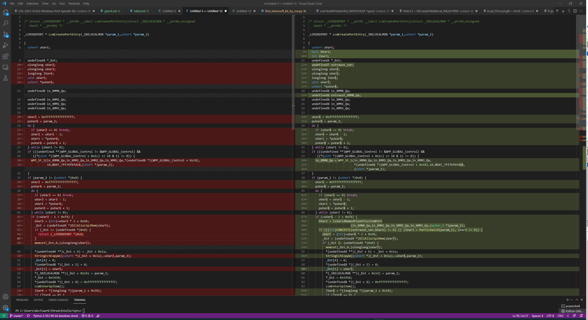
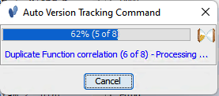
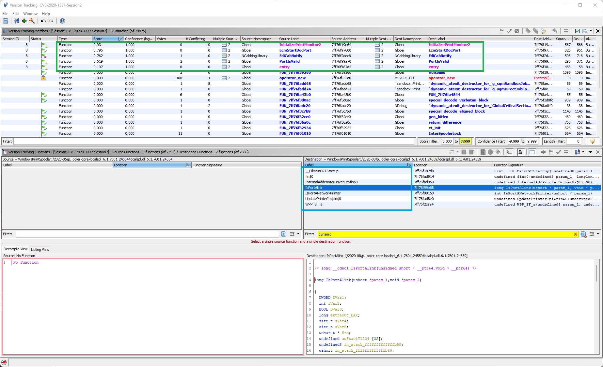
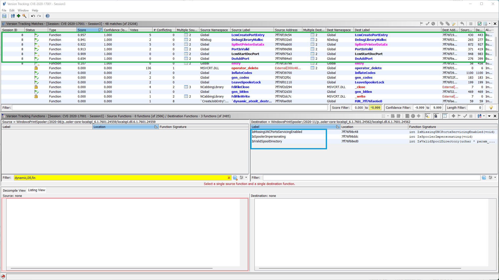

# Patch Diffing Applied

[](https://www.pexels.com/photo/timelapse-photography-of-stars-at-night-169789/)

In this section we leverage patch diffing via [Ghidra Version Tracking](Ghidra%20Version%20Tracking.md) to analyze the differences across the previously identified Windows Print Spooler CVEs (1048,1337,17001).  We will look at each diff individually using the lens of patch diffing as an attempt to get some clarity as to why it took so many attempts to get it right. As we go, we will try to pull in some of our previous CVE Analysis to get some context for each patch.  

```mermaid
gantt

    title Patch diffing sessions comparing N-1,1048,1337,17001
    dateFormat  YYYY-MM-DD
	axisFormat %Y-%m
	
	section Relevant CVEs
	N-1 :a1, 2020-04-14, 2020-05-11 
    CVE-2020-1048 :a2, 2020-05-12, 2020-06-08
	CVE-2020-1337 :a3, 2020-08-11, 2020-09-07
	CVE-2020-17001 :a4, 2020-11-10, 2020-12-07
	
    section Patch Diffing Sessions
    Session1  :l1, 2020-04-14, 2020-06-08 
    Session2 :l2, 2020-06-08, 2020-09-07
	Session3 :l3, 2020-09-07, 2020-12-07

```

Assuming we already have the [prep](Ghidra%20Version%20Tracking.md#Setup%20and%20Prep%20Step%201) work done (Ghidra loaded with the [files needed](Environment%20Setup%20and%20Tooling.md#File%20Collection%20suggested) for diffing and [symbols downloaded](Environment%20Setup%20and%20Tooling.md#Symbol%20Collection%20mostly%20required)), we can get started.  It's time now to create the a *Version Tracking* session for each diff . 

## Workflow 
```mermaid

graph TD;

subgraph Prep
	A[Create Session] --> B[Load Binary Version A];
	A --> C[Load Binary Version B];
	B --> D[Pass Preconditions];
	C --> D;
	D --> E[Auto Analyze A/B];
end	
subgraph Evaluation


	E --> F[Choose / Run Correlators];
	F --> G[Generate Associations];
	G --> H[Evaluate Matches];
	H --> I[Accept Matching Functions];
	I --> J[Discover Enough Differences];
	J -- Yes --> K[End];
	J -- No --> F;
end

```

The prep stage for each session is the same. Find the binaries to diff and load them into Ghidra for analysis. The evaluation takes place in the latter half of the workflow is the meat of the process.  For each session we will try to discover all the changes, additions, and deletions. From this information, combined with our CVE analysis context, we will try to make sense of each of the patches.

## CVE-2020-1048 Version Tracker - Session 1
```mermaid
gantt

    title Patch diffing sessions comparing N-1,1048,1337,17001
    dateFormat  YYYY-MM-DD
	axisFormat %Y-%m
	
	section Relevant CVEs
	N-1 :a1, 2020-04-14, 2020-05-11 
    CVE-2020-1048 :a2, 2020-05-12, 2020-06-08
	CVE-2020-1337 :a3, 2020-08-11, 2020-09-07
	CVE-2020-17001 :a4, 2020-11-10, 2020-12-07
	
    section Patch Diffing Sessions
    Session1  :crit, l1, 2020-04-14, 2020-06-08 
    Session2 :l2, 2020-06-08, 2020-09-07
	Session3 :l3, 2020-09-07, 2020-12-07
```

In the first session we will compare a vulnerable *localspl.dll* (N-1) and the patch for CVE-2020-1048. The prep steps (1 + 2) will be glossed as have been covered in detail in the overview of the [Version Tracker Workflow](Ghidra%20Version%20Tracking.md#Version%20Tracker%20Workflow). This section will focus on the running of the correlators and evaluation.

Binaries compared:
- N-1 --> *localspl.dll* (6.1.7601.24383)
- CVE-2020-1048 --> *localspl.dll* (6.1.7601.24554)

### Prep

1. [Setup and Prep Step 1](Ghidra%20Version%20Tracking.md#Setup%20and%20Prep%20Step%201) - Load both binaries into the session.  
2. [Auto-analysis Step 2](Ghidra%20Version%20Tracking.md#Auto-analysis%20Step%202) - Ensure you have symbols loaded prior to analysis. 

### Correlators + Evaluation
3. [Run Correlators Step 3](Ghidra%20Version%20Tracking.md#Run%20Correlators%20Step%203)
	1. Start with *Automatic Version Tracking* .
4. [Evaluating Matches Step 4](Ghidra%20Version%20Tracking.md#Evaluating%20Matches%20Step%204) - The results are pretty good. At least for finding [new](Ghidra%20Version%20Tracking.md#Identifying%20New%20Functions) and [deleted](Ghidra%20Version%20Tracking.md#Identifying%20Deleted%20Functions) functions. After running the automatic correlators, all functions from the N-1 binary were matched with a function in the new binary.  This can be derived from the fact that the lower pane *Version Tracking Functions Table* is empty for the *source* binary once the "Show Only Unmatched Functions"  filter is applied (ie no functions were deleted). 
	
	
	<sub> Left *source* pane empty after "Show Only Unmatched" filter applied</sub>
	
	From the same filter we can identify two brand new functions in the patched *destination* binary, that have no match in the vulnerable version.
	
	 
	- *IsPortNamedPipe*
	- *IsValidNamedPipeOrCustomPort*

	These functions seem quite relevant for CVE-2020-1048 if we go back review our  our CVE-2020-1048 Analysis [requirements](Resources/CVEs/CVE-2020-1048.md#Requirements): 
	> ## Requirements
	>*what stars needed to align?*
	>
	>- User context
	>	- unprivileged users can add printers (and assign a printer port)
	>	- ability to assign a printer port to an arbitrary file path.  
	>		- Several APIs are able to do this. Some clients have security checks for the path `PortIsValid`, some do not. This is a **Client Side Port Check Vulnerability**.
	
	
    We aren't quite done, as we can't yet see the [changed](Ghidra%20Version%20Tracking.md#Identifying%20Changed%20Functions) functions. If you remember, Ghidra has some deficiencies with it's default correlators. Currently, all the matches contain either a score of 1.0 or 0 (implied matches have a score of 0).
	
	
	
5. Time to [Boost The Signal](Ghidra%20Version%20Tracking.md#Boosting%20The%20Signal) - Once the default correlators have run. It is now time to run one of the additional correlators offered by [PatchDiffCorrelator](https://github.com/threatrack/ghidra-patchdiff-correlator).

	
	
	Running the *Bulk Basic Block Mneumonics Match* (*File --> Add to Session.. --> Check Bulk Basic Block Mnemonics Match -> Click Through Default Options*)  produces new matches, and with the default options, will only run the correlator on already accepted matches. More details on which correlator to run, and tips as to which options can be found on the [github page](https://github.com/threatrack/ghidra-patchdiff-correlator) or from [Boosting The Signal](Ghidra%20Version%20Tracking.md#Boosting%20The%20Signal) section. 
	
	
	
After filtering out perfect matches, only one change is found. `LcmCreatePortEntry` is the only row with a score less than 1.0.  This is an ideal scenario. Two new functions have been added, and only one function was changed. 

Taking a quick look at `LcmCreatePortEntry` decompilation in both the *source* and *destination* code browser, we can see the changes new code. 


<sub> Decompilation from Ghidra Code Browser for `LcmCreatePortEntry` diffed with VScode</sub>

A bit easier to simply take a look at the *Function Call Tree* Results:


<sub> Function Call Tree from both *source* and *destination* for `LcmCreatePortEntry` diffed with VScode</sub>

`LcmCreatePortEntry` has added some extra checks:
- `PortIsValid` - which existed in the vulnerable version, but was not called within this function. 
- `IsValidNamedPipeOrCustomPort` - A new function introduced in the same update as CVE-2020-1048. The other new function `IsPortNamedPipe` is called within this new one. 


### CVE Analysis Context

From our [CVE-2020-1048  Analysis](Resources/CVEs/CVE-2020-1048.md):

>>PrintDemon is an elevation of privilege (EoP) vulnerability that exists in the Windows Print Spooler service as it improperly allows arbitrary file writing on the file system [](https://voidsec.com/cve-2020-1337-printdemon-is-dead-long-live-printdemon/)

The primary issues with CVE-2020-1048 were:
1. Client Side Port Check Vulnerability - only checking whether or not a port is valid on the client side (and there was a code path on the server side that didn't call the check)
2.  Self Impersonation (SYSTEM) - The Spooler impersonated itself when it didn't have the correct user context (after service restarts).

This patch added the `PortIsValid` check to `LcmCreatePortEntry`, which ensures the server checks that the port (think file path to be written to) is valid on the server side as well. 

This is confirmed the public report:
>If the system is patched, however, this won’t work. Microsoft fixed the vulnerability by now moving the `PortIsValid` check inside of `LcmXcvDataPort`.
>[Source](https://windows-internals.com/printdemon-cve-2020-1048/#:~:text=Microsoft%20fixed%20the%20vulnerability%20by%20now%20moving%20the%20PortIsValid%20check%20inside%20of%20LcmXcvDataPort)

Actually, mostly line up.  Did they have a typo? `LcmCreatePortEntry` != `LcmXcvDataPort`.  

Notice, there are two primary issues **with only one addressed.** 
	
### Session 1 - Patch Diff Summary
| New Functions                                           | Deleted Functions | Changed Functions    |
| ------------------------------------------------------- | ----------------- | -------------------- |
| - `IsValidNamedPipeOrCustomPort`<br>- `IsPortNamedPipe` | None              | `LcmCreatePortEntry` |


## CVE-2020-1337 Version Tracker - Session2 - Speed Round
```mermaid
gantt

    title Patch diffing sessions comparing N-1,1048,1337,17001
    dateFormat  YYYY-MM-DD
	axisFormat %Y-%m
	
	section Relevant CVEs
	N-1 :a1, 2020-04-14, 2020-05-11 
    CVE-2020-1048 :a2, 2020-05-12, 2020-06-08
	CVE-2020-1337 :a3, 2020-08-11, 2020-09-07
	CVE-2020-17001 :a4, 2020-11-10, 2020-12-07
	
    section Patch Diffing Sessions
    Session1  :l1, 2020-04-14, 2020-06-08 
    Session2 :crit, l2, 2020-06-08, 2020-09-07
	Session3 :l3, 2020-09-07, 2020-12-07
	


```


Binaries compared:
- CVE-2020-1048 --> *localspl.dll* (6.1.7601.24554)
- CVE-2020-1337 --> *localspl.dll* (6.1.7601.24559)

For this session the same steps will be applied with a bit less hand holding. 

### Running Correlators

1. Run *Automatic Version Tracking*
2. Run *Bulk Basic Block Mneumonics Match* Correlator




### Evaluation

#### Identifying New and Deleted Functions


<sub> Two new function found. Filter applied to filter out garbage filter names</sub>

There were no deleted functions (empty left pane). As for new functions we have:
- `IsPortAlink`
- `IsPortANetworkPrinter`
 
#### Identifying  Changed Functions


The were more changed functions this time around. That being said, there seemed to be some analysis confusion in Ghidra. The Bulk PatchDiffCorrelator found changes in the following functions. 

| Score | Func Label                | Source Size | Dest Size | Comment                                                 |
| ----- | ------------------------- | ----------- | --------- | ------------------------------------------------------- |
| 0.931 | `InitializePrintMonitor2` | 567         | 566       | No functional differences. Compiler?                    | 
| 0.796 | **`LcmStartDocPort`**     | 825         | 951       |                                                         |
| 0.762 | `FdiCabNotify`            | 596         | 716       | Added WPP (tracing)                                     |
| 0.619 | **`PortIsValid`**         | 295         | 371       |                                                         |
| 0.107 | `entry`                   | 458         | 58        | Analysis error. Both are calls to `__DllMainCRTStartup` |


##### Function Call Trees For New Functions
Taking a look at the function call trees for the new functions `IsPortAlink` and `IsPortANetworkPrinter` we can quickly see where they have been placed.


They line up exactly  with the functions that have changed (`LcmStartDocPort` and `PortIsValid`.   

#### CVE Analysis Context

CVE-2020-1337 was a bypass for CVE-2020-1048. The primary issue with the patch for CVE-2020-1048 was that it: 
>Unfortunately, the patch has two main issues:
>1. Patch leaves the system vulnerable to pre-existing ports.
>2. Even worse, the check of user read/write permissions on the given path is performed only on port creation event.
>[Source](https://voidsec.com/cve-2020-1337-printdemon-is-dead-long-live-printdemon/)

CVE-2020-1337 used a [junction directory](https://voidsec.com/cve-2020-1337-printdemon-is-dead-long-live-printdemon/#:~:text=s%20patch%20via%20a-,junction%20directory,-.%20PrintDemon%E2%80%99s%20patch%20was) to exercise a TOCTOU vulnerability that remained after the CVE-2020-1048 patch. The check `PortIsValid` added in `LcmCreatePortEntry` for CVE-2020-1048 was only checking the port on creation.  After creation of the port, the attacker could change the directory

```powershell
PS C:\Users\user> New-Item -ItemType Junction -Path "C:\Users\user\userDir\"  -Target "C:\Windows\System32"
```
<sub> Powershell command to create a reparse point </sub> 

In the CVE-2020-1337 patch the `PortIsValid` call is made when the port is added (Time of Check) as before (with an add `PortIsALink` check, hence the change discovered). 


`LcmStartDocPort` was also updated. 


<sub> Copy-paste from the *Function Call Tree* Window diffed in vscode</sub>

The `LcmStartDocPort` call is performed when the port path will be written to (Time of Use). They added several port checks to prevent an invalid port. It seems like they solved the TOCTOU issue.   But again, that wasn't the only [issue](https://windows-internals.com/printdemon-cve-2020-1048/#:~:text=The%20Spooler%20is%20impersonating%E2%80%A6%20SYSTEM). 

### Session 2 - Summary
| New Functions                                | Deleted Functions | Changed Functions                     |
| -------------------------------------------- | ----------------- | ------------------------------------- |
| - `IsPortAlink`<br>- `IsPortANetworkPrinter` | None              | - `LcmStartDocPort`<br>-`PortIsValid` | 


## CVE-2020-17001 Version Tracker - Session3
```mermaid
gantt

    title Patch diffing sessions comparing N-1,1048,1337,17001
    dateFormat  YYYY-MM-DD
	axisFormat %Y-%m
	
	section Relevant CVEs
	N-1 :a1, 2020-04-14, 2020-05-11 
    CVE-2020-1048 :a2, 2020-05-12, 2020-06-08
	CVE-2020-1337 :a3, 2020-08-11, 2020-09-07
	CVE-2020-17001 :a4, 2020-11-10, 2020-12-07
	
    section Patch Diffing Sessions
    Session1  :l1, 2020-04-14, 2020-06-08 
    Session2  :l2, 2020-06-08, 2020-09-07
	Session3  :crit, l3, 2020-09-07, 2020-12-07
	


```


Binaries compared:
- CVE-2020-1048 --> *localspl.dll* (6.1.7601.24559)
- CVE-2020-1337 --> *localspl.dll* (6.1.7601.24562)


### Running Correlators



### Evaluation

#### Identifying New and Deleted Functions


<sub> Two new function found. Filter applied to filter out garbage filter names</sub>


No deleted functions (empty left pane).  New functions:
- `IsMissingUNCPortsServicingEnabled`
- `IsSpoolerImpersonating`
- `IsValidSpoolDirectory`


#### Identifying  Changed Functions


| Score | Func Label            | Source Size | Dest Size | Comment                                   |
| ----- | --------------------- | ----------- | --------- | ----------------------------------------- |
| 0.957 | `LcmCreatePortEntry`  | 430         | 443       |                                           |
| 0.941 | `DebugLibraryMalloc`  | 265         | 277       | Minor changes.                            |
| 0.922 | `SplSetPrinterDataEx` | 872         | 927       | Added `IsValidSpoolDirectory`             |
| 0.913 | `PortIsValid`         | 371         | 419       |                                           |
| 0.909 | `LcmStartDocPort`     | 948         | 983       | Added `IsSpoolerImpersonating`            |
| 0.654 | `DoAddPort`           | 276         | 399       | Added `IsMissingUNCPortsServicingEnabled` | 


#### Adding CVE Analysis Context


> CVE-2020-17001 was detailed by [James Forshaw](https://twitter.com/tiraniddo) in his bug [report](https://bugs.chromium.org/p/project-zero/issues/detail?id=2075&q=CVE-2020-17001&can=1). He details yet another way to break the path validation by using a [UNC path](https://docs.microsoft.com/en-us/dotnet/standard/io/file-path-formats#:~:text=Universal%20naming%20convention) for the port assignment. 
> [CVE-2020-17001](Resources/CVEs/CVE-2020-17001.md)

For this session we once again have quite a few changed functions. As we recall from CVE-2020-1048, there were two primary issues.

>The primary issues with CVE-2020-1048 were:
>1. Client Side Port Check Vulnerability - only checking whether or not a port is valid on the client side (and there was a code path on the server side that didn't call the check)
>2.  Self Impersonation (SYSTEM) - The Spooler impersonated itself when it didn't have the correct user context (after service restarts).

CVE-2020-17001 is yet another way to circumvent the first issue (port validation).  At this point, it is pretty clear that they have added `IsSpoolerImpersonating` to stop printing to a port at all if spooler is running as `SYSTEM` (If it is not Impersonating).  After several attemps, it seems that they have finally fixed the [root cause](Root%20Cause%20Analysis.md).

### Session 3 - Summary
| New Functions                                                                                    | Deleted Functions | Changed Functions                                                                                            |
| ------------------------------------------------------------------------------------------------ | ----------------- | ------------------------------------------------------------------------------------------------------------ |
| - `IsMissingUNCPortsServicingEnabled`<br>- `IsSpoolerImpersonating`<br>- `IsValidSpoolDirectory` | None              | - `LcmCreatePortEntry`<br>- `SplSetPrinterDataEx`<br>- `PortIsValid`<br>- `LcmStartDocPort`<br>- `DoAddPort` |


## Aside - Patches Are Not Necessarily Atomic
```mermaid
gantt

title Multplie CVEs Per Security Update
dateFormat YYYY-MM-DD
axisFormat %Y-%m

section CVE Release Dates
section 2020-Nov
CVE-2020-17042 :crit, cve16, 2020-11-10, 30d
CVE-2020-17014 :crit, cve17, 2020-11-10, 30d
CVE-2020-17001 :cve18, 2020-11-10, 30d
section 2020-Sep
CVE-2020-1030 :cve22, 2020-09-08, 30d
section 2019-Mar
section 2020-Aug
CVE-2020-1337 :cve19, 2020-08-11, 30d
section 2020-May
CVE-2020-1070 :crit, cve20, 2020-05-12, 30d
CVE-2020-1048 :cve21, 2020-05-12, 30d
section 2020-April
N-1 :n1, 2020-04-14,30d

    section Patch Diffing Sessions
    Session1  :l1, 2020-04-14, 2020-06-08 
    Session2 :l2, 2020-06-08, 2020-09-07
	Session3 :l3, 2020-09-07, 2020-12-07
	
```

The CVEs anlayzed for each session across security updates were not always the only changes. Taking a look at the CVEs with there security updates, we can see that CVE-2020-1070 was patched alongisde CVE-2020-1048.  We did no analysis of CVE-2020-1070 (as we had no public articles or insight into 1070), but based on the function names added, I bet it had something to do with an issue [named pipes](https://docs.microsoft.com/en-us/windows/win32/ipc/named-pipes). 

> - `IsValidNamedPipeOrCustomPort` - A new function introduced in the same update as CVE-2020-1048. The other new function `IsPortNamedPipe` is called within this new one. 

It could be beneficial to try and understand CVE-2020-1070 to understand the vulnerability behind that CVE and learn about it's vulnerability class. To *patch diff in the dark* is an excellent way to analyze vulnerabilities that haven't had as much fanfare or public exposure. 

Additionally, besides other CVE updates, there are sometimes *feature* (vs security) updates that coincide with CVEs. In that case expect more functions to discover and potential non-security changes.  


## Reason why patch wasn't robust

Cost benefit analysis. Sometimes the cure is more painful than the cost.  several competing priorities. 

Sources - https://www.trendmicro.com/en_us/research/19/i/from-bindiff-to-zero-day-a-proof-of-concept-exploiting-cve-2019-1208-in-internet-explorer.html
	
	
## Conclusion

There you have it. Binary truth.  It isn't magic, simply focused. Patch diffing gives you the ability to go and see for yourself what has changed. When the patch is specifically related to security, you can bring out the exact code changes that were made to patch a vulnerability. When you combine the changes made with what you know from CVE analysis, the picture becomes that much clearer.  These CVEs were chosen to point out that patches aren't perfect. It took Microsoft several tries to get it right. Really, until the root cause of a vulnerability is fixed, there always seems to be a workaround.  In the next section, we will dive into an introductory lesson for root cause analysis.  We will take a high level view, combining what we know from our CVE analysis and patch diffing to help us always seek out the [root cause](Root%20Cause%20Analysis.md). 


## 2021 Update

Blackhat this year hosted a talk from [avid](https://twitter.com/edwardzpeng)) Spooler researchers. They shared several vulnerabilities they had discovered and had a similar analysis of these CVEs.  Check out their [talk](https://www.youtube.com/watch?v=fOUOFGdiNTA) and [slides](https://i.blackhat.com/USA21/Wednesday-Handouts/us-21-Diving-Into-Spooler-Discovering-Lpe-And-Rce-Vulnerabilities-In-Windows-Printer.pdf).  I assume they might also be doing some patch diffing to keep on eye on spooler.


---

### Course Map
```mermaid

graph TD;

classDef current fill:#00cc66;

F:::current;
A1[N-1] --> |"localspl.dll (6.1.7601.24383)"| F;
A[CVE-2020-1048] --> |"localspl.dll (6.1.7601.24554)"| F;
B[CVE-2020-1337] --> |"localspl.dll (6.1.7601.24559)"| F;
C[CVE-2020-17001] --> |"localspl.dll (6.1.7601.24562)"| F;
G[CVE Analysis] --> F;
F[Patch Diffing + CVE Analysis];


```