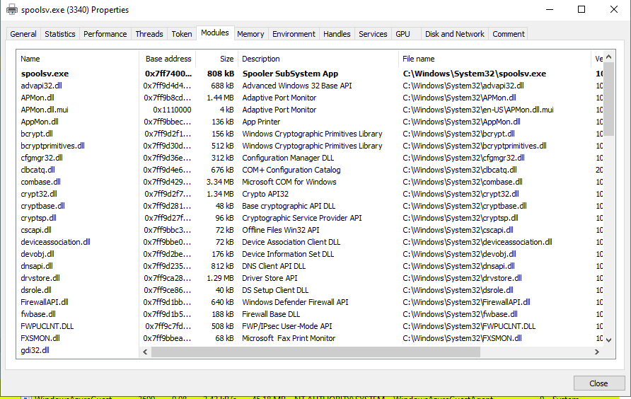
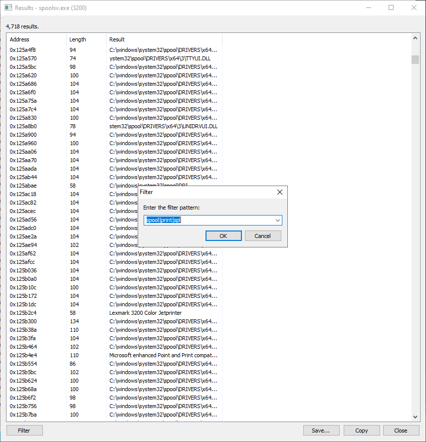
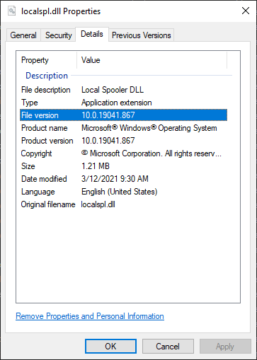

# Security Patches


<sub>Photo by [Mohdammed Ali](https://unsplash.com/@mohdali_31?utm_source=unsplash&utm_medium=referral&utm_content=creditCopyText) on [Unsplash](https://unsplash.com/photos/-IYOJNgGhpk?utm_source=unsplash&utm_medium=referral&utm_content=creditCopyText)</sub>

>A **patch** is a set of changes to a computer program or its supporting data designed to update, fix, or improve it. [](https://en.wikipedia.org/wiki/Patch_(computing))

Software patches are necessary to improve software over time.  Whether a new feature is being provided or the latest security hole needs to be plugged, patching software is means to update binaries across most major distributions.  

## Platform Security Updates

Every major platform has their own mechanism for distributing feature and security updates for their operating systems.  These updates provide critical security fixes (or patches) necessary to protect systems and users. This section of the article will use the term *updates* and *patches* interchangeably. 

The Windows path will be taken and specific focus given to the security patches related to a subset of the previously analyzed CVEs.

- [CVE-2020-1048](CVE-2020-1048.md)
- [CVE-2020-1337](CVE-2020-1337.md)
- [CVE-2020-17001](CVE-2020-17001.md)

### Windows Update Support Lifecycle

The complexity of managing software updates across the many versions of Windows is vast.  There are several [versions](https://en.wikipedia.org/wiki/List_of_Microsoft_Windows_versions) of the operating system to consider with varying [lifecycle](https://docs.microsoft.com/en-us/lifecycle/) support expectations across each product.  Lifecycle support can be taken to be the period for which Microsoft will support the product with security updates ( with the exception of the [Extended Security Update Program](https://docs.microsoft.com/en-us/lifecycle/faq/extended-security-updates)).  

A quick view of recent older Windows versions [lifecycle suport](https://docs.microsoft.com/en-us/lifecycle/products/?terms=windows):

|Listing|Start Date|Mainstream End Date|Extended End Date|
|--- |--- |--- |--- |
|Windows XP|12/31/2001|04/14/2009|04/08/2014|
|Windows 7|10/22/2009|01/13/2015|01/14/2020|

And for Windows 10, which uses an auto-update channel with 2 major releases a year, the lifecycle support generally lasts between 18 and 20 months from the release date.

A recent look being[](https://docs.microsoft.com/en-us/windows/release-health/release-information):

|Version|Servicing option|Availability date|OS build|Latest revision date|End of service: Home, Pro, Pro Education, Pro for Workstations and IoT Core|End of service: Enterprise, Education and IoT Enterprise|
|--- |--- |--- |--- |--- |--- |--- |
|20H2|Semi-Annual Channel|2020-10-20|19042.804|2021-02-09|2022-05-10|2023-05-09|
|2004|Semi-Annual Channel|2020-05-27|19041.804|2021-02-09|2021-12-14|2021-12-14|
|1909|Semi-Annual Channel|2019-11-12|18363.1411|2021-02-16|2021-05-11|2022-05-10|
|1809|Semi-Annual Channel|2019-03-28|17763.1790|2021-02-16|End of service|2021-05-11|
|1809|Semi-Annual Channel (Targeted)|2018-11-13|17763.1790|2021-02-16|End of service|2021-05-11|
|1803|Semi-Annual Channel|2018-07-10|17134.2026|2021-02-09|End of service|2021-05-11|
|1803|Semi-Annual Channel (Targeted)|2018-04-30|17134.2026|2021-02-09|End of service|2021-05-11|


### Windows Update Sources

- [Microsoft Update Catolog](https://www.catalog.update.microsoft.com/Home.aspx) 
- [Windows Server Update Services](https://en.wikipedia.org/wiki/Windows_Server_Update_Services) 
- [Microsoft Update](https://www.update.microsoft.com/) 

Windows has three primary sources for obtaining updates. Updates can be automated for a workstation by using the default [Microsoft Update](https://www.update.microsoft.com/) or more fine grained controlled by corporate admins using Windows Server Update Services ([WSUS](https://en.wikipedia.org/wiki/Windows_Server_Update_Services)).  This article will focus on the only practical method to download specific patches based on CVE or timeframe. The ability to search for a specific patch is available using the [Microsoft Update Catolog](https://www.catalog.update.microsoft.com/Home.aspx). 

###  Types of Windows Updates

Windows updates come in all [shapes and sizes](https://docs.microsoft.com/en-us/troubleshoot/windows-client/deployment/standard-terminology-software-updates). The goal for the Windows platform, or really any platform, is to have all of its users running fully patched machines.  

>**Installing the most recent update means that you also get all the previous updates, including important security fixes.** [](https://support.microsoft.com/en-us/topic/windows-7-sp1-and-windows-server-2008-r2-sp1-update-history-720c2590-fd58-26ba-16cc-6d8f3b547599)

Typically, updates will contain all the files necessary to fully patch the system being updated. These are called **cumulative updates** for Windows 10 and **Monthly Rollups** for Windows 7.  Windows also issues **security only** to address specific CVEs.  For [Patch Diffing](Patch%20Diffing.md), the latter type is ideal.  The less there is to sort through, the better. In fact, if a patch for a particular CVE is available on Windows 7 (no matter the update type), analyze that update as opposed to windows 10.  As Windows 7 is no longer officially supported, the exception being [Extended Security Updates](https://docs.microsoft.com/en-us/lifecycle/faq/extended-security-updates, the changes to binaries within the particular update typically only include security relevant updates.  

#### Update Availability
- [Windows 7 SP1 and Windows Server 2008 R2 SP1 update history](https://support.microsoft.com/en-us/topic/windows-7-sp1-and-windows-server-2008-r2-sp1-update-history-720c2590-fd58-26ba-16cc-6d8f3b547599)
- [Windows 8.1 and Windows Server 2012 R2 update history](https://support.microsoft.com/en-us/topic/windows-8-1-and-windows-server-2012-r2-update-history-47d81dd2-6804-b6ae-4112-20089467c7a6)
- [Windows 10 update history](https://support.microsoft.com/en-us/topic/windows-10-update-history-53c270dc-954f-41f7-7ced-488578904dfe)


From the history links are details about each of the updates. Based on lifecycle support and type of update, availability typically resembles this table. 

**Update Availability By Source**:

|Source | Cumulative | Security-Only| Next-Step|
|---|---|---|---|
| Windows Update and Microsoft Update | Yes | No | None. This update will be downloaded and installed automatically from Windows Update. |
| Microsoft Update Catalog | Yes | Yes | To get the standalone package for this update, go to the Microsoft Update Catalog website. |
| Windows Server Update Services (WSUS) | Yes | Yes | This update will automatically sync with WSUS if you configure Products and Classifications as follows: Product: Windows 10, version 1903 and later Classification: Security Updates |


So now we know different types of patches, how do we find the one we need for our particular CVE? 

## Finding the Haystack (Relevant Patches)

```mermaid

graph LR;

A[CVE] --> B[MSRC info page];
B --> C[KB article];
C --> D[MUC site];
D --> E[MSU archive]


```

An individual update (especially depending on whether or not it is **security only** or **cumulative**) will provide a large set of patched binaries.  What is required though it to find the set of binaries (or haystack) relevant your particular CVE. For a particular CVE, the path to find the haystack is as follows. 

From the references section the **CVE** details on [MITRE's page](https://cve.mitre.org), follow the link link to Microsoft's Security Response Center (**MSRC**).  From the MSRC, a link to the appropriate Knowledge Base (**KB**) article can be found.  The KB article will list a specific ID ( ie. *KB4556799*) than can finally be searched for in Microsoft Update Catalog (**MUC**). MUC will then provide a download link to a Microsoft Standalone Update (MSU) containing several update files for the corresponding update.

### CVE-1048-2020 relevant patch

Here is a run through with links included for *CVE-2020-1048*.

- CVE - Browse to the corresponding [CVE listing](https://cve.mitre.org/cgi-bin/cvename.cgi?name=CVE-2020-1048). 
	- Find link to corresponding MSRC
- [MSRC article](https://msrc.microsoft.com/update-guide/en-US/vulnerability/CVE-2020-1048)
	- From here the KB number for the corresponding OS can be found:
		- Windows 7 for x64-based Systems Service Pack 1
			- Monthly Rollup - 4556836 -  https://support.microsoft.com/help/4556836
			- Security Only - 4556843 - https://support.microsoft.com/help/4556843
		- Windows 10 Version 1903 for x64-based Systems
			- 4556799 - https://support.microsoft.com/help/4556799
	- Also of note is the date to help determine what is included in this patch relative to the current file system.
		- May 12, 2020
- KB - article describing details of CVE and other patch requirements
	- Windows 7 for x64-based Systems Service Pack 1
			- Monthly Rollup - 4556836 -  https://support.microsoft.com/help/4556836
			- Security Only - 4556843 - https://support.microsoft.com/help/4556843
	- Windows 10 Version 1903 for x64-based Systems
		- 4556799 - https://support.microsoft.com/help/4556799
- MSU - actual download from catalog
	- Windows 7 for x64-based Systems Service Pack 1
		- [Monthly Rollup](https://catalog.update.microsoft.com/v7/site/Search.aspx?q=KB4556836)
		- [Security Only](https://catalog.update.microsoft.com/v7/site/Search.aspx?q=KB4556843)
	- Windows 10 Version 1903 for x64-based Systems
		- [Security Update](https://catalog.update.microsoft.com/v7/site/Search.aspx?q=KB4556799)

In the end, you want to collect and extract the relevant MSU file. 
- Windows 10 - `windows10.0-kb4556799-x64_9de920d8738612baa81a751b003ff98f0ce7156b.msu`
- Windows 7
	- Security Only - `windows6.1-kb4556843-x64_b98b5ff5cd7e9989df36db39bdb735e2e354b436.msu`
	- Monthly Rollup - `windows6.1-kb4556836-x64_81f1637b7d3bf105dcf88f3256be0119a3bb6cc4.msu`
	


### Extracting the patch

Now that we have the relevant patch archive (MSU), we need to take a look inside. 

#### Manually

[Expand](https://docs.microsoft.com/en-us/windows-server/administration/windows-commands/expand) the MSU file:
```powershell
mkdir tmp
expand -F:* .\windows6.1-kb4556843-x64_b98b5ff5cd7e9989df36db39bdb735e2e354b436.msu .\tmp\
Microsoft (R) File Expansion Utility
Copyright (c) Microsoft Corporation. All rights reserved.

Adding .\tmp\WSUSSCAN.cab to Extraction Queue
Adding .\tmp\Windows6.1-KB4556843-x64.cab to Extraction Queue
Adding .\tmp\Windows6.1-KB4556843-x64-pkgProperties.txt to Extraction Queue
Adding .\tmp\Windows6.1-KB4556843-x64.xml to Extraction Queue

Expanding Files ....

Expanding Files Complete ...
4 files total.
```

The MSU file contains 4 files with `Windows6.1-KB4556843-x64.cab` containing all  the patched files. Another expand command is required:  
```powershell
expand -F:* .\tmp\Windows6.1-KB4556843-x64.cab .\2020-05\
.
.
.
Adding .\2020-05\amd64_ntprint.inf_31bf3856ad364e35_6.1.7601.24553_none_9983b903ea91b16c\amd64\p6disp.gpd to Extraction Queue

Expanding Files ....
Progress: 86 out of 2921 files

```

The extracted patch files for the "security-only" update contains 2921 files.  These updates can be quite large (the monthly rollup patch for May exceeds 23K files). 

#### Patch extraction automation

In order to sort through the madness, there are several open source scripts that will help you make sense of all the files found within the MSU file. Following along from a recent blog post about [extracting patches in 2020](https://wumb0.in/extracting-and-diffing-ms-patches-in-2020.html), this [Patch Extract script](Resources/Patch%20Extract.md)  will run through and recursively extract the binaries into a architecture relevant directory structure:

```powershell
Mode                 LastWriteTime         Length Name
----                 -------------         ------ ----
d-----         2/22/2021   8:07 PM                JUNK
d-----         2/22/2021   8:06 PM                MSIL
d-----         2/22/2021   8:07 PM                PATCH
d-----         2/22/2021   8:06 PM                WOW64
d-----         2/22/2021   8:06 PM                x64
d-----         2/22/2021   8:06 PM                x86
```

From there it is much simpler to search for your relevant files and they are already sorted.  


## Finding the needle (Relevant Files)

Out of all the files, how do you know which files are relevant for your software component?  Good question.  If you are familiar with and understand the system, you likely know which binary to look at. If you are just starting off, well it’s part of the process. You’re going to have to dig in.

Try to answer some questions to lead in the right direction.  Are you looking at a system binary? Where are they stored?  Is it a service you are looking at?  Where do services live? Using the *Windows Print Spooler* as an example, we know that it is a service and windows binary, so odds are that the code lives in `C:\windows\System32`.  Assuming no knowledge of the system, it might be easiest to use a tool like Process Explorer or Process Hacker to understand which modules are loaded at runtime, which would point out which binaries contain the code we are seeking. 


### Finding  the files you care about

Essentially, you want to build up an awareness of the code that makes up your software component.  There are several ways to go about this.  

#### Read the docs

Not all software comes with an instruction manual. Official documentation will not always be available. Luckily, for the Windows Print Spooler, there is quite a bit of information from Microsoft's Developer Network ([MSDN](https://en.wikipedia.org/wiki/Microsoft_Developer_Network))

- MSDN
	- [Printing (Documents and Printing) - Win32 apps | Microsoft Docs](https://docs.microsoft.com/en-us/windows/win32/printdocs/printdocs-printing)
	- [Print Spooler API Functions - Win32 apps | Microsoft Docs](https://docs.microsoft.com/en-us/windows/win32/printdocs/printing-and-print-spooler-functions)
- Books
	- [How Windows Printing Works | Terminal Services for Microsoft Windows Server 2003: Advanced Technical Design Guide (Advanced Technical Design Guide series) (flylib.com)](https://flylib.com/books/en/2.748.1.44/1/)
	- [Printing Concepts | Microsoft Windows XP Professional Resource Kit 2003 (flylib.com)](https://flylib.com/books/en/2.922.1.91/1/)

#### Simple Process Explorer/Hacker Technique

Not knowing anything about the *Windows Print Spooler*,  you could use [Process Explorer](https://docs.microsoft.com/en-us/sysinternals/downloads/process-explorer) or [Process Hacker](https://github.com/processhacker/processhacker/releases) to find more.  As simple as typing "spool" or "print" in the search would find the Windows Print Spooler Process.

>`spoolssv.exe`

##### Grep Loaded Modules

Within Windows there is typically a single process (.exe) that acts as the container, loading several dynamic link libraries (.dlls) (modules) to add functionality.  In trying to figure out which dlls the spooler is running, simply take a look at the loaded modules tab form within Process Hacker. 



From the [full list of modules](Resources/Process%20Hacker%20Spooler%20Modules%20List%20Windows%2010.md), a subset could be filtered out using keywords like *print* or *spool*

```powershell
PS C:\Users\dev> cat 'Process Hacker Spooler Modules List Windows 10.md'|findstr /i print
```

|Name|Base Address| Size | Description | File Name | Version | Load Time | 
|---|---|---|---|---|---|---|
| win32spl.dll.mui | 0x18e0000 | 4 kB | Client Side Rendering Print Provider | C:\Windows\System32\en-US\win32spl.dll.mui | 10.0.19041.1 |  |
| inetpp.dll.mui | 0x18f0000 | 4 kB | Internet Print Provider DLL | C:\Windows\System32\en-US\inetpp.dll.mui | 10.0.19041.1 |  |
| FXSMON.dll | 0x7ff9bbea0000 | 68 kB | Microsoft  Fax Print Monitor | C:\Windows\System32\FXSMON.dll | 10.0.19041.804 | 3:40:17 PM 2/26/2021 |
| AppMon.dll | 0x7ff9bbec0000 | 136 kB | App Printer | C:\Windows\System32\AppMon.dll | 10.0.19041.1 | 3:40:17 PM 2/26/2021 |
| PrintIsolationProxy.dll | 0x7ff9bbef0000 | 76 kB | Print Sandbox COM Proxy Stub | C:\Windows\System32\PrintIsolationProxy.dll | 10.0.19041.1 | 3:40:17 PM 2/26/2021 |
| usbmon.dll | 0x7ff9bbb10000 | 944 kB | Standard Dynamic Printing Port Monitor DLL | C:\Windows\System32\usbmon.dll | 10.0.19041.746 | 3:40:17 PM 2/26/2021 |
| winprint.dll | 0x7ff9b89b0000 | 64 kB | Windows Print Processor DLL | C:\Windows\System32\spool\prtprocs\x64\winprint.dll | 10.0.19041.804 | 3:40:19 PM 2/26/2021 |
| win32spl.dll | 0x7ff9b88d0000 | 884 kB | Client Side Rendering Print Provider | C:\Windows\System32\win32spl.dll | 10.0.19041.746 | 3:40:19 PM 2/26/2021 |
| inetpp.dll | 0x7ff9b8890000 | 204 kB | Internet Print Provider DLL | C:\Windows\System32\inetpp.dll | 10.0.19041.1 | 3:40:19 PM 2/26/2021 |

```powershell
PS C:\Users\dev2> cat '.\Process Hacker Spooler Modules List Windows 10.md'|findstr /i spool
```

|Name|Base Address| Size | Description | File Name | Version | Load Time | 
|---|---|---|---|---|---|---|
| spoolsv.exe.mui | 0x910000 | 4 kB | Spooler SubSystem App | C:\Windows\System32\en-US\spoolsv.exe.mui | 10.0.19041.1 |  |
| localspl.dll.mui | 0x10f0000 | 80 kB | Local Spooler DLL | C:\Windows\System32\en-US\localspl.dll.mui | 10.0.19041.1 |  |
| spoolsv.exe | 0x7ff740030000 | 808 kB | Spooler SubSystem App | C:\Windows\System32\spoolsv.exe | 10.0.19041.746 | 3:40:14 PM 2/26/2021 |
| spoolss.dll | 0x7ff9bbf40000 | 116 kB | Spooler SubSystem DLL | C:\Windows\System32\spoolss.dll | 10.0.19041.1 | 3:40:17 PM 2/26/2021 |
| localspl.dll | 0x7ff9bbf60000 | 1.24 MB | Local Spooler DLL | C:\Windows\System32\localspl.dll | 10.0.19041.804 | 3:40:17 PM 2/26/2021 |
| winspool.drv | 0x7ff9bc0a0000 | 568 kB | Windows Spooler Driver | C:\Windows\System32\winspool.drv | 10.0.19041.746 | 3:40:17 PM 2/26/2021 |
| winprint.dll | 0x7ff9b89b0000 | 64 kB | Windows Print Processor DLL | C:\Windows\System32\spool\prtprocs\x64\winprint.dll | 10.0.19041.804 | 3:40:19 PM 2/26/2021 |

While this list may not be comprehensive, it provides a record of what code is currently loaded within the spooler process.  

##### Search Process Memory

To dig a little deeper, you could search the memory (both the on-disk image memory and the process address space) for strings related to the spooler. 


Within the strings you can easily search using regular expressions:


Useful string filters for the spooler: 
- `spool`
- `print`
- `spl`
- `dll`

```bash
$ cat image_private_spooler2.txt  | egrep "spool|print|spl|.dll" | cut -f3 -d " " | grep dll | egrep -v "printscan|ext|\\\\" | sort | uniq -c
      1 api-ms-onecoreuap-print-render-l1-1-0.dll
      1 FaxPrinterInstaller.dll
      1 LoadLibrary(ntprint.dll)
      7 localspl.dll
      1 LocalSpl.dll
      1 localspl.dll.mui
      1 nspoolss.dll
      3 ntprint.dll
      2 Print.ResourcesLib.dll
      1 Print.Workflow.Source.dll
      8 PrintConfig.dll
      1 PrintFilterPipelinePrxy.dll
      1 PrintIsolationProxy.dll
      3 PrintSandboxProxy.dll
      2 printui.dll
      1 rundll32.exe
      3 spoolss.dll
      5 tsprint.dll
      1 wifidisplay.dll
      7 win32spl.dll
      4 winprint.dll
      1 wsplib.dll
      1 xpsprint.dll
```

### Relevant files for the Windows Print Spooler

We now have a list of **potentially** relevant Windows Printer Spooler binaries: 

- `winprint.dll` -  Windows Print Processor DLL
- `winspool.drv` - Windows Print Spooler Driver
- `localspl.dll` - Local Spool DLL
- `spoolss.dll` - Spooler Subsystem DLL
- `spoolsv.exe` - Spooler Subsystem App
- `FXSMON.dll` - Microsoft  Fax Print Monitor 
- `AppMon.dll` - App Printer
- `PrintIsolationProxy.dll` - Print Sandbox COM Proxy Stub 
- `usbmon.dll` - Standard Dynamic Printing Port Monitor DLL
- `winprint.dll` - Windows Print Processor DLL 
- `win32spl.dll` - Client Side Rendering Print Provider 
- `inetpp.dll` - Internet Print Provider DLL

<sub>*Removed [MUI](https://docs.microsoft.com/en-us/windows/win32/intl/mui-resource-management) files as they are language resources and not relevant code changes. </sub>

Next, we need to figure out which files are **actually** relevant. 

## Finding the binaries to compare

So at this point we have done our best to download the patch corresponding the the CVE being analyzed. We also have a good idea of the location of relevant code paths for the software component we are analyzing.  Which helps us find out which needles (files) in the haystack (relevant patch) we need to pay attention to.

The last piece of our puzzle is to determine which versions of the binaries to to use for comparison in [Patch Diffing](Patch%20Diffing.md). In order to understand which code modifications were made relevant to a patch, the typical way to do that is to obtain the version relevant to your patch (see above). Then take the version of the  binary just prior to the CVE patch of interest. 

**Have:**
- CVE of interest
	- Patch related to CVE
	- List of relevant code for software of interest

**Need:**
- Version of binary or binaries released before the relevant CVE patch or the **N-1** update.


### Finding the N-1 Update

For a any Windows binary, the patch cycle could look like this:

```mermaid
gantt

    title Sample Binary Windows 10 1909 Patch Lifecycle 
    dateFormat  YYYY-MM-DD
    section Patch Lifecycle
    OEM Release  - 10.0.18362.1  :a1, 2019-10-12, 30d
    Security KB4524570 - 10.0.18362.476  :a2, after a1, 30d
    Cumulative KB4530684 - 10.0.18362.535 :a3, after a2, 30d
    Cumulative KB4528760 - 10.0.18362.592 :a4, after a3, 30d
    Fully Patched  - 10.0.18362.697 :a5, after a4, 30d

```

From that we essentially want to find the "CVE Relevant Patch" and the N-1 version of that binary. This is to meet the goal of reducing the complexity of analysis, by minimizing the changes that we need to look at. 

```mermaid
gantt

    title Finding the N-1
    dateFormat  YYYY-MM-DD
    section Patch Lifecycle
    OEM Release  - 10.0.18362.1  :a1, 2019-10-12, 30d
    Security KB4524570 - 10.0.18362.476  :a2, after a1, 30d
	Cumulative KB4530684 - 10.0.18362.535 :a3, after a2, 30d
    Cumulative KB4528760 - 10.0.18362.592 :a4, after a3, 30d	
    Fully Patched  - 10.0.18362.697 :a5, after a4, 30d
	section CVE Relevant and N-1
	Cumulative KB4530684 - 10.0.18362.535 :active, a3, after a2, 30d
    CVE Relevant Patch - 10.0.18362.592 :crit, a4, after a3, 30d


```

For **each relevant file** we want to compare, we need to collect the patch corresponding to the CVE and the build before it.  Each binary will be tagged with an *OS Build* version number.  If the CVE Relevant Patches binary build number is *10.0.18362.535*, your **N-1** is the OS Build < *10.0.18362.535*.  Each cumulative update is inclusive and should include a copy of the binary our are seeking. The version number of the particular binary may not change across monthly cumulative patches, but will change if modifications were made to the binary. 

#### Checking Binary OS Build Version Number
1. Right-Click -> Properties
2. Select *Details* tab
3. See *File Version*



### Finding the needles for CVE-2020-1048 

The patch for CVE-2020-1048 was released in May 2020 as determined [previously](Security%20Patches.md#CVE-1048-2020%20relevant%20patch).  
Download April 2020 (N-1) and May 2020 (CVE-2020-1048).  
- *2020-05 Security Monthly Quality Rollup for Windows Embedded Standard 7 for x64-based Systems (KB4556836)* - `windows6.1-kb4556836-x64_81f1637b7d3bf105dcf88f3256be0119a3bb6cc4.msu`
- *2020-04 Security Monthly Quality Rollup for Windows 7 for x64-based Systems (KB4550964)* - `windows6.1-kb4550964-x64_2a8ada96b48a57fd2d3a377c8635f420f237e71b.msu`

Unpack the patches. Run a regular diff command to determine which files were updated. 

Find only modified or new files:
```bash
diff -qr ~/Patches/win7April2020Monthly/x64 ~/Patches/win7May2020Monthly/x64 |cut -f4 -d' '
```

Full output: [Modified Patch Files for Monthly Rollup May 2020 - CVE-2020-1048](Resources/Modified%20Patch%20Files%20for%20Monthly%20Rollup%20May%202020%20-%20CVE-2020-1048.md)

From the modified files, which ones match out *relevant files* list above?

Modified in May 2020 Monthly Rollup:
```bash
diff -qr ~/Patches/win7April2020Monthly/x64 ~/Patches/win7May2020Monthly/x64 | cut -f3-4 -d' ' | grep -v April | sed -r 's/: /\//g'  | xargs find {} | egrep 'winprint|winspool|localspl|spool|fxsmon|appmon|print|usbmon|winprint|win32spl|inetpp'
```

```bash 
~/Patches/win7May2020Monthly/x64/p..ooler-core-localspl_6.1.7601.24554
~/Patches/win7May2020Monthly/x64/p..ooler-core-localspl_6.1.7601.24554/localspl.dll
~/Patches/win7May2020Monthly/x64/p..ooler-core-localspl_6.1.7601.24554/winprint.dll
```

**CVE-2020-1048 needles found**: 
- `localspl.dll` - Local Spool DLL
- `winprint.dll` - Windows Print Processor DLL


#### Windows 10 vs Windows 7 Cumulative patches

Windows 10 treats cumulative patches a bit differently than Windows 7. Instead of supplying the full binary in each cumulative patch release, a forward and reverse differential is provided. The **r** and **f**  sub-directories indicate either a reverse or forward differential.

```
2020-04-Patches-1909/x64/p..ooler-core-localspl_10.0.18362.693/f/localspl.dll
2020-04-Patches-1909/x64/p..ooler-core-localspl_10.0.18362.693/f/winprint.dll
2020-04-Patches-1909/x64/p..ooler-core-localspl_10.0.18362.693/r/localspl.dll
2020-04-Patches-1909/x64/p..ooler-core-localspl_10.0.18362.693/r/winprint.dll
```

```
2020-05-Patches-1909/x64/p..ooler-core-localspl_10.0.18362.836/f/winprint.dll 
2020-05-Patches-1909/x64/p..ooler-core-localspl_10.0.18362.836/r/localspl.dll 
2020-05-Patches-1909/x64/p..ooler-core-localspl_10.0.18362.836/r/winprint.dll
2020-05-Patches-1909/x64/p..ooler-core-localspl_10.0.18362.836/f/localspl.dll 
```

##### Generating a specific version
```mermaid

graph LR;


A[localspl.10.0.18362.693.dll] --Reverse Difff from 693--> B[localspl.10.0.18362.1.dll];
B --Forward Diff From 836--> C[localspl.10.0.18362.836.dll];


```

In order to obtain the binary matching a specific update patch level (when you want to create a specific version of the binary different than the one that exists already on your system), you can follow this process: 

Starting with the current System32 binary (`System32\localspl.dll`) on your system at a specific version (say 10.0.18362.693), you can apply the reverse differential, leveraging [Micrsoft's Delta APIs](https://docs.microsoft.com/en-us/previous-versions/bb417345(v=msdn.10)) , from the Windows 10 MSU Update (`2020-04-Patches-1909/x64/p..ooler-core-localspl_10.0.18362.693/r/localspl.dll`) to revert it back to version one (10.0.18362.1).  From there, the forward differential can be applied to bring it back to the patch level specified by the MSU update (`2020-05-Patches-1909/x64/p..ooler-core-localspl_10.0.18362.836/f/localspl.dll`). 

Further detail of the process is spelled out in this article for generating the correct binary from [Extracting and Diffing Windows Patches in 2020 - wumb0in'](https://wumb0.in/extracting-and-diffing-ms-patches-in-2020.html).


### Finding CVE-2020-1337 and CVE-2020-17001 Needles

A condensed version is listed here as the details are listed for the previous example. The Windows 7 \x64 monthly patches were used for analysis. 

#### CVE-2020-1337

[CVE-2020-1337](https://cve.mitre.org/cgi-bin/cvename.cgi?name=CVE-2020-1337) -> [MSRC](https://msrc.microsoft.com/update-guide/en-US/vulnerability/CVE-2020-1337) -> [KB 4571719](https://support.microsoft.com/help/4571719) --> [MUC](https://www.catalog.update.microsoft.com/Search.aspx?q=KB4571729) --> [MSU file](http://download.windowsupdate.com/d/msdownload/update/software/secu/2020/08/windows6.1-kb4571729-x64_62b8672a50cebb4bfcd4fb16e18a39ab472a5269.msu)

- *2020-08 Security Monthly Quality Rollup for Windows 7 for x64-based Systems (KB4571729)* - `windows6.1-kb4571729-x64_62b8672a50cebb4bfcd4fb16e18a39ab472a5269.msu`

```bash
$ find 2020-08/x64/ | grep localspl
2020-08/x64/p..ooler-core-localspl_6.1.7601.24559
2020-08/x64/p..ooler-core-localspl_6.1.7601.24559/localspl.dll
2020-08/x64/p..ooler-core-localspl_6.1.7601.24559/winprint.dll
```

#### CVE-2020-17001

[CVE-2020-17001](https://cve.mitre.org/cgi-bin/cvename.cgi?name=CVE-2020-17001) -> [MSRC](https://msrc.microsoft.com/update-guide/en-US/vulnerability/CVE-2020-17001) -> [KB 4586827](https://support.microsoft.com/help/4586827) --> [MUC](https://www.catalog.update.microsoft.com/Search.aspx?q=KB4586827) --> [MSU file](http://download.windowsupdate.com/c/msdownload/update/software/secu/2020/11/windows6.1-kb4586827-x64_e560961572fe8c0ba7533bd1e88e9614d86a966a.msu)

- *2020-11 Security Monthly Quality Rollup for Windows 7 for x64-based Systems (KB4586827)* - `windows6.1-kb4586827-x64\_e560961572fe8c0ba7533bd1e88e9614d86a966a.msu`

```bash
$ find 2020-11/x64/ | grep localspl
2020-11/x64/p..ooler-core-localspl_6.1.7601.24562
2020-11/x64/p..ooler-core-localspl_6.1.7601.24562/localspl.dll
2020-11/x64/p..ooler-core-localspl_6.1.7601.24562/winprint.dll
```


## Wrapping up

```mermaid
gantt

    title Relevant Win7 (6.1.7601) Monthly Patches for N-1,1048,1337,17001
    dateFormat  YYYY-MM-DD
	axisFormat %Y-%m
	
	section Monthly Cumulative Patches	
	KB4550964 :m1, 2020-04-14, 2020-05-11 
	KB4556836 :m2, 2020-05-12, 2020-06-08
	KB4561643 :done, m3, 2020-06-09, 2020-07-13
	KB4565524 :done, m4, 2020-07-14, 2020-08-10
	KB4571729 :m5, 2020-08-11, 2020-09-07
	KB4577051 :done, m6, 2020-09-08, 2020-10-12
	KB4580345 :done, m7, 2020-10-13, 2020-11-09
	KB4586827 :m8, 2020-11-10, 2020-12-07
	KB4592471 :done, m9, 2020-12-08, 2021-01-11
	KB4598279 :done, m10, 2021-01-12, 2021-02-08
		
	section Relevant CVEs
	N-1 :a1, 2020-04-14, 2020-05-11 
    CVE-2020-1048 :a2, 2020-05-12, 2020-06-08
	CVE-2020-1337 :a3, 2020-08-11, 2020-09-07
	CVE-2020-17001 :a4, 2020-11-10, 2020-12-07
	
    section localspl.dll versions
    24383  :l1, 2020-04-14, 2020-05-11 
    24554  :l2, 2020-05-12, 2020-06-08
	24559  :l3, 2020-08-11, 2020-09-07
	24562  :l4, 2020-11-10, 2020-12-07
	


```

Files needed for Patch Diffing
- **N-1** - localspl.dll (6.1.7601.**24383**)
- **CVE-2020-1048** - localspl.dll (6.1.7601.**24554**)
- **CVE-2020-1337** - localspl.dll (6.1.7601.**24559**)
- **CVE-2020-17001** - localspl.dll (6.1.7601.**24562**)

We now have everything we need to move on to the actual [Patch Diffing](Patch%20Diffing.md).  If following along, don't forget to [setup the tools](Environment%20Setup%20and%20Tooling.md) we will be using for the analysis. 

---


